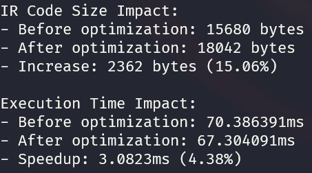
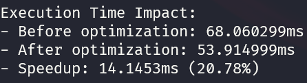

# LLVM Optimization Passes in the COOL Compiler

This document explains the LLVM optimization passes implemented in the COOL compiler and discusses their impact on the generated code.

## Implemented Optimization Passes

The COOL compiler implements two LLVM optimization passes:

### 1. Function Inlining (`inline`)

**Description**: Function inlining is an optimization technique that replaces a function call with the body of the called function. This eliminates the overhead of the function call itself (pushing arguments to the stack, jumping to the function, and returning).

**Implementation**: The compiler uses LLVM's inlining pass with the command:
```
opt -passes=inline -inline-threshold=1000 input.ll -o output.ll
```

**Benefits**:
- Eliminates function call overhead
- Enables more aggressive optimizations by exposing the function body to the caller's context
- Can be particularly effective for small, frequently called functions

**Potential Drawbacks**:
- Increases code size if the inlined function is large or called from many places
- May reduce instruction cache efficiency due to larger code size

### 2. Interprocedural Sparse Conditional Constant Propagation (`ipsccp`)

**Description**: Constant propagation is an optimization technique that identifies variables with constant values and replaces them directly with those constants throughout the code. The interprocedural variant works across function boundaries.

**Implementation**: The compiler applies IPSCCP after function inlining using the command:
```
opt -passes=ipsccp input.ll -o output.ll
```

**Benefits**:
- Eliminates computations that can be performed at compile time
- Simplifies code by replacing variables with their constant values
- May enable dead code elimination when conditions with constant outcomes are encountered
- Works globally across function boundaries

**Potential Drawbacks**:
- Limited effectiveness if the code doesn't contain many computations with constant values

## Measuring Optimization Impact

The compiler measures and reports the impact of these optimizations in two ways:

1. **Code Size Impact**: Compares the size of the LLVM IR files before and after optimization.
2. **Execution Time Impact**: Creates both optimized and unoptimized executables and compares their execution times.

## Expected Impact on Different Code Types

### Small Test Programs

For small test programs, the impact of these optimizations may be minimal for several reasons:
- Simple programs may not have many function calls to inline
- Variables may already be used optimally 
- The overhead of loading the program may dominate execution time

### Complex Programs

For more complex COOL programs, these optimizations are likely to have a more significant impact:
- Programs with many small functions will benefit from inlining
- Code with complex calculations involving constants will benefit from constant propagation
- The benefits often compound when multiple optimizations work together

## Example Optimization Impact

On one trial, I got these results:



The IR code size certainly increased (though the number of lines decreased), but we see an execution time speedup of 4.38%.

When I used `-O2` optimization, the speedup was even better:



*Note: Actual results will vary based on specific program characteristics.*

## Advanced Considerations

- **Optimization Interactions**: Function inlining is applied first because it exposes more opportunities for constant propagation by bringing code into the same context.
- **Optimization Order**: The order of optimizations matters. Different sequences of optimizations can produce different results.
- **Optimization Levels**: In production compilers, these optimizations would typically be part of broader optimization levels (like `-O1`, `-O2`, etc.).
